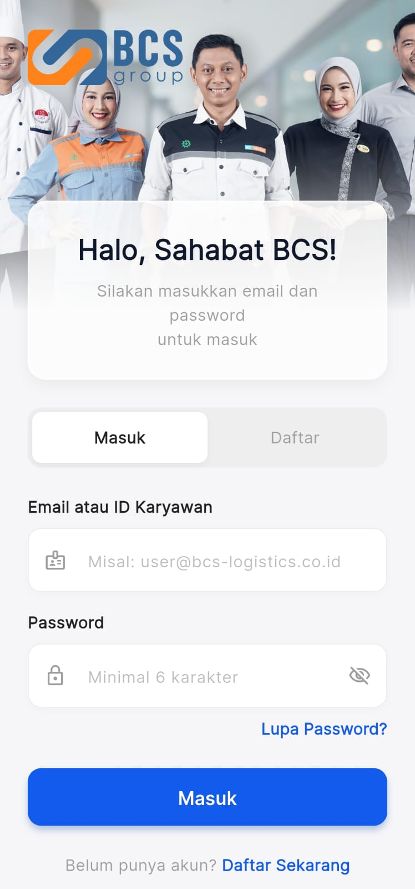
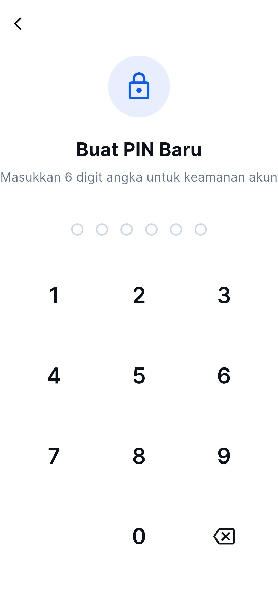
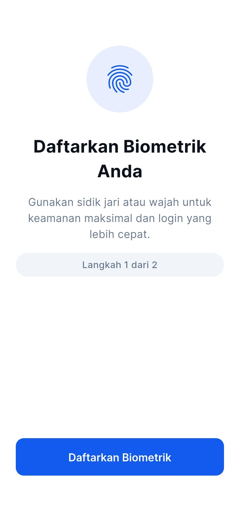

# Memulai Aplikasi Presensi

Selamat datang di Aplikasi Presensi Karyawan. Bagian ini menjelaskan langkah-langkah awal untuk menggunakan aplikasi, mulai dari masuk (login) hingga mendaftarkan keamanan biometrik Anda.

## 1.1 Cara Masuk (Login) Langkah Pertama

Untuk menjaga keamanan, pendaftaran akun baru hanya dapat dilakukan oleh **Admin SDM/HR**. Anda akan diberikan ID Karyawan (atau email) dan kata sandi sementara.

**Langkah Login:**
1. Buka aplikasi Presensi.
2. Di halaman utama, pastikan *toggle* berada di posisi **Masuk**.
3. Ketik **Email atau ID Karyawan** Anda pada kolom yang disediakan.
4. Ketik **Kata Sandi** sementara Anda.
5. Tekan tombol **Masuk**.

> **Penting**: Setelah berhasil masuk untuk pertama kalinya, Anda akan langsung disarankan untuk mendaftarkan PIN keamanan.

## 1.2 Pengaturan Keamanan (PIN & Biometrik)

Aplikasi memiliki tingkat keamanan ganda ala perbankan untuk memastikan akun Anda tidak dipakai orang lain untuk absen.

### Pendaftaran PIN (Wajib)
PIN 6 digit akan menjadi benteng keamanan utama Anda, terutama saat HP Anda tidak bisa memindai sidik jari.

- Masukkan 6 angka yang mudah Anda ingat tapi sulit ditebak.
- Konfirmasi kembali 6 angka tersebut.

### Pendaftaran Biometrik (Sidik Jari / Pemindai Wajah)
Jika HP Anda mendukung memori Sidik Jari (Fingerprint) atau FaceID, sangat disarankan untuk mengaktifkannya.

- Saat muncul notifikasi "Jadikan Sidik Jari sebagai login utama?", pilih **Gunakan Sidik Jari**.
- Tempelkan jari/wajah Anda pada sensor HP Anda.
- Ke depannya, Anda cukup menempelkan sidik jari saat membuka aplikasi atau saat absen!

## 1.3 Lupa Kata Sandi & Lupa PIN

Karena aplikasi ini terikat langsung pada identitas perangkat keras (Device ID) HP Anda demi mencegah kecurangan GPS, saat ini fitur mereset sandi/PIN mandiri tidak diaktifkan.

**Apa yang harus dilakukan jika lupa?**
- Jika Anda lupa PIN, silakan hubungi langsung **Admin HRD**.
- Admin akan melakukan hapus sesi atau *reset PIN* dari portal Admin Web.
- Setelah diluruskan oleh Admin, Anda bisa mendaftar PIN baru di HP Anda.
