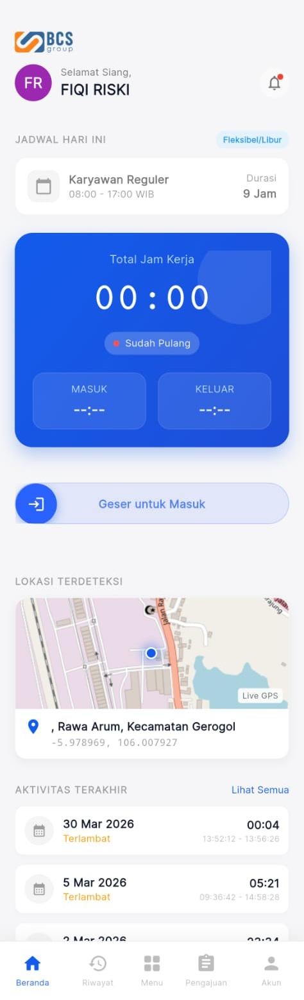

# Absensi Harian

Panduan ini mengatur urusan paling vital untuk Anda setiap hari: Presensi!

## 2.1 Cara Absen Masuk (Clock-In)

Pastikan untuk absen sebelum jam / jadwal shift Anda dimulai agar tidak tercatat "Terlambat".

1. Buka aplikasi, Anda akan langsung melihat halaman Beranda (Dashboard).
2. Di bagian bawah layar, terdapat tombol geser biru bertuliskan **Geser untuk Masuk**.
3. Geser tombol panah tersebut ke arah kanan.
4. Aplikasi akan otomatis mengunci sistem GPS HP Anda (Pastikan fitur Lokasi menyala di HP Anda).
5. Akan muncul layar sensor **Keamanan**:
   - Tempelkan sidik jari Anda, **ATAU**
   - Masukkan 6 digit PIN (jika gagal sidik jari atau Anda memilih opsi PIN).
6. Selesai! Aplikasi akan memunculkan spanduk hijau di atas layar: "Absen Masuk Berhasil!".

## 2.2 Live Timer: Total Jam Kerja
Begitu Anda berhasil **Absen Masuk**, kotak biru di tengah beranda yang bernama "Total Jam Kerja" akan terus berdetak bagai stopwatch (misal `01:15:30` -> 1 jam 15 menit). Ini memudahkan Anda memantau berapa lama Anda sudah berada di jam operasional kantor.

## 2.3 Tes Tingkat Kelelahan (Khusus Operator Alat Berat / Mengemudi)
Bagi karyawan dengan *Role* sebagai "Operator", kesehatan Anda diutamakan.
- Saat Anda menggeser tombol *Clock-In*, layar tidak langsung meminta sidik jari. 
- Layar akan berpindah ke mode **Fatigue Test (Tes Kelelahan)**.
- Anda akan dites kecepatan reaksi ketukan layar untuk melihat kesigapan Anda hari itu.
- Jika terdeteksi sangat lelah, segera lapor atasan, Anda mungkin disarankan istirahat.

## 2.4 Cara Absen Keluar (Clock-Out) & Offline Mode

### Absen Keluar Normal (Pulang)
1. Setelah bekerja, buka lagi aplikasi (tombol geser akan berubah merah: **Geser untuk Pulang**).
2. Geser ke kanan, verifikasi biometrik/PIN.
3. Tampilan waktu *Total Jam Kerja* akan berhenti berdetak menunjukan hasil akhir jam kerja Anda. Status berubah menjadi "Selesai Bekerja".

### Bagaimana jika Internet Kantor Putus? (Mode Offline)
Jangan panik! Aplikasi ini dirancang pintar.
- Walau ikon WiFi / 4G HP Anda silang (mati), Anda **tetap bisa absen Masuk/Pulang**.
- Prosesnya sama: Geser tombol, lengkapi PIN/Sidik jari.
- Datanya tidak akan hilang, melainkan disimpan dulu di dalam memori HP.
- Ketika sinyal HP kembali 4G / tersambung WiFi, aplikasi akan otomatis **mensinkronisasikan (mengirim)** data absen yang tertahan tersebut ke server pusat!
