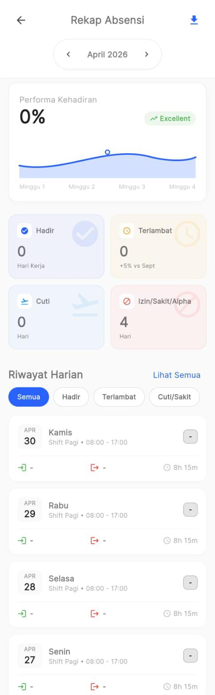
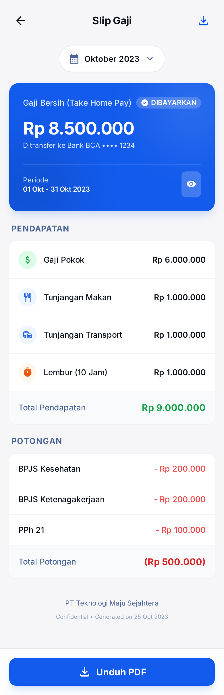
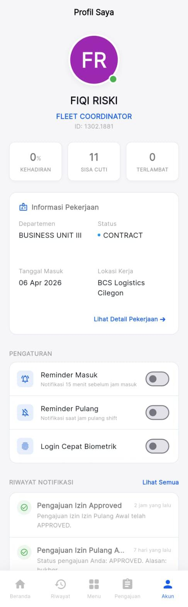

# Pantauan Kinerja & Laporan

Anda memiliki hak penuh untuk mengecek performa kehadiran dan slip gaji Anda sendiri tanpa harus selalu menanyakannya ke HRD. 

Akses semua ini di ikon **Profil** atau fitur spesifik dari menu **Eksplorasi (Explore)**.

## 3.1 Mengecek Rekap Absensi Bulanan
Fitur **Performance / Rekap Kehadiran** memungkinkan Anda membandingkan kerajinan Anda bulan demi bulan.

1. Di halaman Beranda, klik kotak kecil berikon diagram di menu "Eksplorasi".
2. Buka menu **Riwayat Presensi** (Tab paling bawah pada Navigation Bar) atau Rekap Absensi.
3. Anda bisa mengatur *Filter Bulan & Tahun*. 
4. Layar akan memunculkan:
   - Jumlah hari **Hadir**
   - Jumlah hari **Terlambat**
   - Jumlah hari **Izin / Cuti**

## 3.2 Mengecek & Mengunduh Slip Gaji
Slip gaji sekarang berbasis digital sepenuhnya.

1. Masuk ke menu **Slip Gaji (Salary)** dari menu kotak-kotak *Eksplorasi* di Beranda.
2. Anda akan diperlihatkan *Gaji Bulan Ini* dengan rincian (Gaji Pokok, Tunjangan, Potongan).
3. Anda bisa mengeklik salah satu riwayat bulan sebelumnya untuk melihat detail slip gaji masa lalu.

## 3.3 Mengupdate Password & Profil

- Semua informasi jabatan dan departemen Anda akan diselaraskan oleh Admin HRD.
- Untuk saat ini, mengubah *password* harus dikoordinasikan, tetapi Anda bebas mengganti Foto Profil (Avatarnya) dari menu Setting/Profil di pojok kanan agar layar beranda Anda lebih personal!
