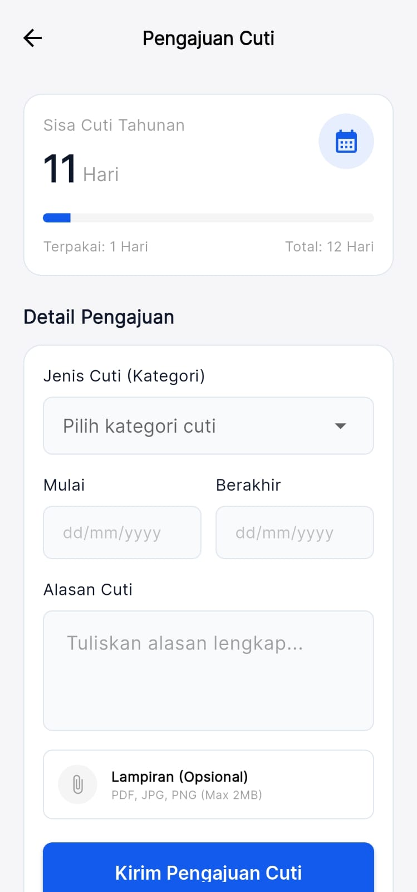
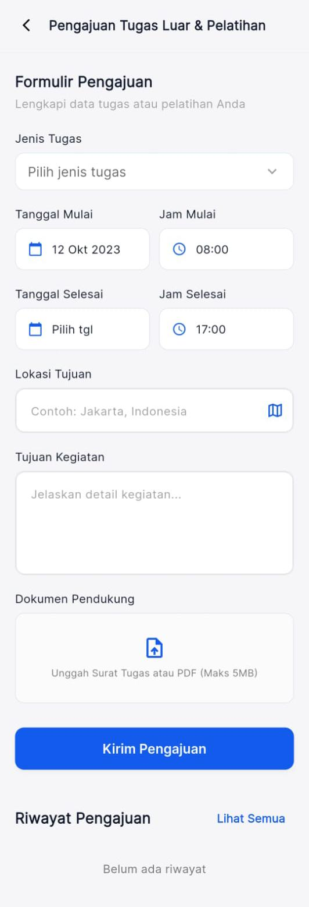

# Menu Pengajuan (Klaim & Approval)

Saat Anda sedang sakit, butuh libur, atau dinas, Anda wajib mendaftarkannya via aplikasi untuk tercatat sah di sistem HR. Pengajuan akan segera mengalir ke HP Atasan/Manager Anda untuk di-*Approve* atau *Reject*.

Semua menu ini bisa diakses lewat kumpulan kotak **Eksplorasi** di Beranda.

## 4.1 Mengajukan Izin & Cuti
Jika Anda sakit, silakan gunakan menu **Izin / Sakit**. Jika Anda punya jatah liburan keluarga, gunakan menu **Pengajuan Cuti**.

1. Buka menu form yang sesuai.
2. Centang tanggal mulai sakit/cuti hingga tanggal berakhir di sistem Kalender pop-up.
3. Di kolom keterangan, ketik alasannya (contoh: "Istri melahirkan", dsb).
4. Gunakan ikon lampiran kertas (*attachment*) untuk **Mengunggah Foto Surat Keterangan Dokter** atau dokumen pendukung.
5. Tekan **Kirim**.

## 4.2 Mengajukan Tugas Luar Kota (Outstation)
Berbeda dengan cuti, kalau Anda Tugas Luar Kota Anda dihargai sebagai status *Bekerja*, namun titik GPS Anda menjauh dari radius kantor.

1. Buka formulir **Tugas Luar**.
2. Anda akan disajikan sebuah Peta (Map).
3. Geser-geser Peta tersebut, dan taruh *"Pin Merah"* mendarat persis di area PT atau dinas tempat Anda akan ditugaskan.
4. Ini membantu sistem melegalkan radius titip GPS absen tugas luar Anda nantinya.
5. Klik simpan dan lengkapi surat pengajuannya.

## 4.3 Mengecek Status Pengajuan
Anda bisa melihat nasib ajuan Anda (Apakah diterima bos atau ditolak) di halaman **Riwayat (History)** dalam setiap formulir pengajuan tersebut (biasanya ada dua Tab: `Form` dan `Riwayat`). 
Statusnya akan berlabel:
- 🔵 **Menunggu** (Belum dibaca atasan)
- 🟢 **Disetujui** (Absen Anda diputihkan dari Alfa di tanggal tersebut)
- 🔴 **Ditolak** (Hubungi atasan lansgung)
